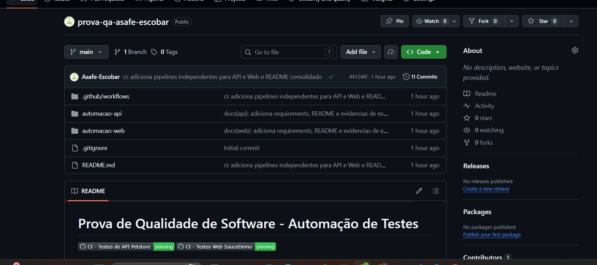
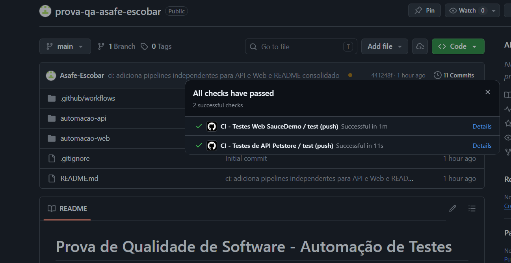

# Prova de Qualidade de Software - Automação de Testes

[](https://github.com/Asafe-Escobar/prova-qa-asafe-escobar/actions/workflows/ci-api.yml)
[](https://github.com/Asafe-Escobar/prova-qa-asafe-escobar/actions/workflows/ci-web.yml)

Repositório consolidado com os dois projetos de automação de testes desenvolvidos para a avaliação da disciplina de Qualidade de Software.

## Visão Geral

Este repositório contém **dois projetos independentes**, cada um em sua própria pasta, com pipelines de Integração Contínua separadas no GitHub Actions:

| Projeto | Pasta | Descrição |
|---|---|---|
| **Automação de API** | [`automacao-api/`](./automacao-api) | Testes de API REST do Swagger Petstore (Pet, Store, User) |
| **Automação Web** | [`automacao-web/`](./automacao-web) | Testes E2E do SauceDemo com Selenium e Page Object Model |

## Tecnologias

- **Python 3.12+** — linguagem principal
- **pytest** — framework de testes para ambos os projetos
- **requests** — cliente HTTP para o projeto de API
- **Selenium WebDriver + webdriver-manager** — automação do navegador
- **GitHub Actions** — pipelines de CI/CD independentes para cada projeto

## Estrutura do Repositório

​```
prova-qa-asafe-escobar/
├── .github/workflows/
│   ├── ci-api.yml              # Pipeline da automação de API
│   └── ci-web.yml              # Pipeline da automação Web
├── automacao-api/              # Projeto de API
│   ├── tests/
│   ├── utils/
│   ├── config.py
│   ├── conftest.py
│   ├── pytest.ini
│   ├── requirements.txt
│   └── README.md
├── automacao-web/              # Projeto Web
│   ├── pages/
│   ├── tests/
│   ├── utils/
│   ├── conftest.py
│   ├── pytest.ini
│   ├── requirements.txt
│   └── README.md
├── .gitignore
└── README.md                   # Este arquivo
​```

## Como Executar

Cada projeto tem suas próprias dependências e instruções detalhadas em seu README específico. As instruções abaixo são um resumo.

### Pré-requisitos

- Python 3.10 ou superior
- Git
- Google Chrome instalado (apenas para o projeto Web)

### Projeto de API

​```bash
cd automacao-api
python -m venv venv
.\venv\Scripts\Activate.ps1
python -m pip install -r requirements.txt
pytest
​```

Mais detalhes em [`automacao-api/README.md`](./automacao-api/README.md).

### Projeto Web

​```bash
cd automacao-web
python -m venv venv
.\venv\Scripts\Activate.ps1
python -m pip install -r requirements.txt
pytest
​```

Mais detalhes em [`automacao-web/README.md`](./automacao-web/README.md).

## Cobertura de Testes

### Automação de API (16 testes)

- **Pet:** criação, busca, atualização, exclusão e cenário negativo (404)
- **Store:** criação de pedido, busca, exclusão, cenário negativo e consulta de inventário
- **User:** criação, busca, atualização, exclusão, cenário negativo e login

### Automação Web (6 testes E2E)

- Login com credenciais válidas
- Login com usuário bloqueado (cenário negativo)
- Adição de produto ao carrinho
- Remoção de produto do carrinho
- Compra E2E completa (login → carrinho → checkout → confirmação)
- Checkout sem preencher dados (cenário negativo)

## Boas Práticas Aplicadas

### Comuns aos dois projetos

- AAA Pattern (Arrange-Act-Assert) em todos os testes
- DRY — configurações e dados centralizados
- Single Responsibility Principle — cada arquivo com uma responsabilidade
- Fixtures do pytest com injeção de dependência
- Cenários positivos e negativos em todos os módulos
- CI/CD independente por projeto, com triggers baseados em alterações de path

### Específicas da Automação de API

- Encapsulamento das chamadas HTTP em uma classe `ApiClient`
- Builder Pattern para geração de payloads de teste isolados
- Geração de IDs únicos evitando conflitos entre execuções

### Específicas da Automação Web

- Page Object Model (POM) — cada página vira uma classe
- Herança via BasePage — métodos comuns centralizados
- Encapsulamento de locators dentro das Page Objects
- Method chaining — métodos retornam `self` permitindo encadeamento
- Configuração baseada em ambiente — variável `HEADLESS` controla modo visual vs invisível
- Estratégia anti-flakiness — espera explícita, scroll automático e fallback de JavaScript click
- Limpeza de estado — cookies e localStorage limpos antes de cada login
- Desabilitação de interferências do navegador — gerenciador de senhas, autofill e popups bloqueados

## Pipelines CI/CD

Os dois projetos têm pipelines independentes no GitHub Actions:

- **`ci-api.yml`** — executa em uma máquina Ubuntu, configura Python 3.12, instala as dependências e roda a suíte de testes da API.
- **`ci-web.yml`** — executa em uma máquina Ubuntu, instala o Google Chrome, configura Python 3.12, instala as dependências e roda os testes E2E em modo **headless**.

Ambas são acionadas em:
- `push` na branch `main` (apenas quando arquivos do respectivo projeto mudam)
- Pull Requests para a `main`
- Manualmente via aba **Actions** do GitHub

> Os filtros de `paths` evitam execuções desnecessárias: alterações na pasta `automacao-api/` só disparam a pipeline da API, e o mesmo vale para a Web.

## Evidências de Execução

### Repositório no GitHub


### Pipelines CI/CD verdes


## Autor

Projeto desenvolvido por **Asafe Escobar** para a disciplina de Qualidade de Software.