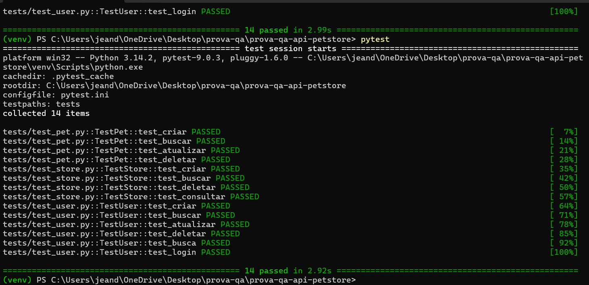
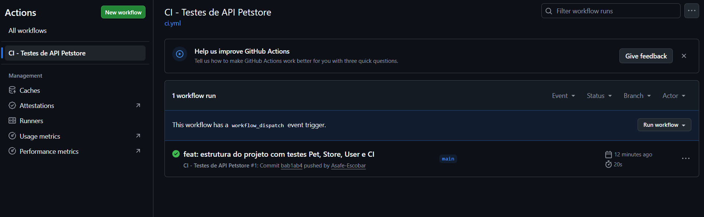

# Automação de Testes de API - Swagger Petstore

[](https://github.com/Asafe-Escobar/prova-qa-api-petstore/actions/workflows/ci.yml)

Projeto de automação de testes para a API pública [Swagger Petstore](https://petstore.swagger.io/), desenvolvido como parte da avaliação da disciplina de Qualidade de Software.

A suíte cobre os três grupos principais de endpoints (**Pet**, **Store** e **User**), incluindo cenários positivos e negativos, e roda automaticamente em uma pipeline de Integração Contínua via GitHub Actions.

## Tecnologias

- Python 3.12+
- pytest — framework de testes
- requests — cliente HTTP
- jsonschema — validação de estruturas JSON
- GitHub Actions — pipeline CI/CD

## Estrutura do Projeto

​```
prova-qa-api-petstore/
├── .github/workflows/
│   └── ci.yml
├── tests/
│   ├── test_pet.py
│   ├── test_store.py
│   └── test_user.py
├── utils/
│   ├── api_client.py
│   └── data_builder.py
├── config.py
├── conftest.py
├── pytest.ini
└── requirements.txt
​```

## Pré-requisitos

- Python 3.10 ou superior
- Git

## Instalação

Clone o repositório:

​```bash
git clone https://github.com/Asafe-Escobar/prova-qa-api-petstore.git
cd prova-qa-api-petstore
​```

Crie e ative um ambiente virtual:

​```bash
python -m venv venv
.\venv\Scripts\Activate.ps1
​```

Instale as dependências:

​```bash
python -m pip install -r requirements.txt
​```

## Execução dos Testes

Rodar a suíte completa:

​```bash
pytest
​```

Rodar apenas um arquivo:

​```bash
pytest tests/test_pet.py
​```

Rodar um teste específico:

​```bash
pytest tests/test_user.py::TestUser::test_login_com_credenciais_validas_retorna_200
​```

## Cobertura de Testes

### Pet
- Criação de pet com dados válidos
- Busca de pet existente
- Atualização de dados
- Exclusão de pet
- Busca de pet inexistente (cenário negativo)

### Store
- Criação de pedido
- Busca de pedido existente
- Exclusão de pedido
- Busca de pedido inexistente (cenário negativo)
- Consulta de inventário

### User
- Criação de usuário
- Busca de usuário existente
- Atualização de dados
- Exclusão de usuário
- Busca de usuário inexistente (cenário negativo)
- Login com credenciais válidas

## Boas Práticas Aplicadas

- Encapsulamento das chamadas HTTP em uma classe `ApiClient`
- Builder Pattern para geração de dados de teste
- AAA Pattern (Arrange-Act-Assert) em todos os testes
- Single Responsibility Principle por arquivo
- DRY (Don't Repeat Yourself) com configurações centralizadas
- Fixtures do pytest com injeção de dependência

## Pipeline CI/CD

A pipeline configurada em `.github/workflows/ci.yml` é executada automaticamente em:
- push na branch `main`
- Pull Requests para a `main`
- Manualmente via aba Actions do GitHub

Etapas executadas em uma máquina Ubuntu:
1. Checkout do código
2. Configuração do Python 3.12
3. Instalação das dependências
4. Execução da suíte de testes

## Evidências de Execução

### Testes executados localmente


### Pipeline CI/CD no GitHub Actions


## Autor

Projeto desenvolvido por **Asafe Escobar** para a disciplina de Qualidade de Software.